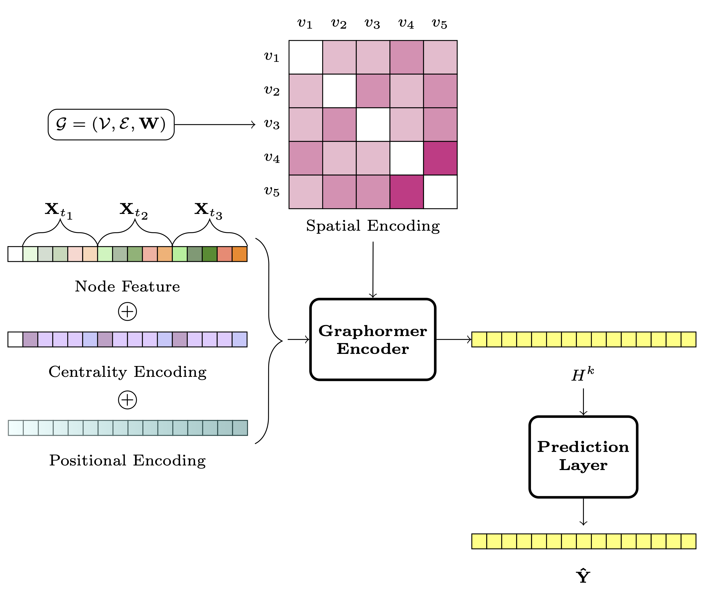
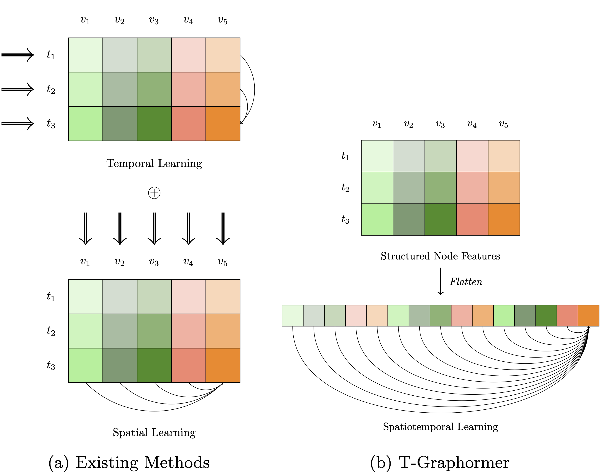

# T-Graphormer

T-Graphormer is a Transformer-based model capable of modelling spatiotemporal correlations simultaneously. By adding temporal encodings in the Graphormer architecture, each node attends to all other tokens within the graph sequence, enabling the model to capture rich spacetime patterns with minimal predefined inductive biases. 

We show the effectiveness of T-Graphormer on real-world traffic prediction benchmark datasets. Compared to state-of-the-art methods, T-Graphormer reduces root mean squared error (RMSE) and mean absolute percentage error (MAPE) by up to 20% and 10%.

<figure id="fig:model" style="text-align: center;">
    
    <figcaption style="text-align: left; margin-top: 0.5rem;">
Fig 1: T-Graphormer model architecture.
    </figcaption>
</figure>

<figure id="fig:arch_diff" style="text-align: center;">
    
    <figcaption style="text-align: left; margin-top: 0.5rem;">
    Fig 2: Information flow differences between existing methods and T-Graphormer. In part (a), the
    double arrows represent the cross-sectional input for each learning module, and the circle represents
    the fusion between the modules
     </figcaption>
</figure>

[](https://paperswithcode.com/sota/traffic-prediction-on-pems-bay?p=t-graphormer-using-transformers-for)
[](https://paperswithcode.com/sota/traffic-prediction-on-metr-la?p=t-graphormer-using-transformers-for)

# Model Summary

The model is trained on two traffic prediction datasets separately (PEMS-BAY & METR-LA). For technical details, see [**paper**](https://www.arxiv.org/abs/2501.13274).

Pretrained Weights:
[https://www.kaggle.com/models/markbai/t-graphormer_pred_mini](https://www.kaggle.com/models/markbai/t-graphormer_pred_mini)
## Usage

``` Python

def load_model(model_fp, model):
    with pathmgr.open(model_fp, 'rb') as f:
        checkpoint = torch.load(f, map_location='cpu')

    if "model" in checkpoint.keys():
        checkpoint_model = checkpoint["model"]
    else:
        checkpoint_model = checkpoint["model_state"]

    msg = model.load_state_dict(
        checkpoint_model,
        strict=False
    )
    print(msg)
    return model

model = model_finetune.graph_pred_mini(
    cls_token=True,
    end_channel=64,
    **dataset_args
)
model = load_model(
    model_fp=model_fp,
    model=model,
)
```

## System
To use the model, clone the T-Graphormer repo
``` Bash
git clone https://github.com/rdh1115/T-Graphormer.git
```

If you're using it in Kaggle, you might need to run the the following cell
``` Python
import os, sys
os.chdir("/kaggle/working/T-Graphormer/src")
os.getcwd()

module_path = os.path.abspath(os.path.join('..'))
if module_path not in sys.path:
    sys.path.append(module_path)
sys.path
```

## Implementation requirements
Virtual environment setup:
``` Bash
pip install -r requirements_no_version.txt
```

An example of hyperparameter grid search script is provided in `scripts/grid_finetune.sh`.\
It submits a new job to SLURM workload manager for each combination.

Training was done with DDP on 2 compute nodes. Each compute node has 2 Intel Silver 4216 Cascade CPUs, and 4 NVIDIA V100 Volta GPUs with 32 GB. This totals to 8 V100 GPUs and 64 cores of CPU.

On the *PEMS-BAY* dataset, training, validation, and model checkpoint took an average of 7.5 hours for **mini** models and 13.8 hours for **small** models. On the *METR-LA* dataset, it took an average of 4.5 hours for **mini** and 8.5 hours **small** model. See [Model stats](#model-stats) for details on model sizes.


On Kaggle, inference can be done without accelerators.

# Model Characteristics

## Model initialization

Model was trained from scratch. We use `torch.nn.init.trunc_normal_` for initialization. PEMS-BAY was trained for 50 epochs, METR-LA was trained for 100 epochs. 

## Model stats
| Dataset                | PEMS-BAY            | PEMS-BAY            | METR-LA             | METR-LA             |
|------------------------|---------------------|---------------------|---------------------|---------------------|
| Configuration          | mini                | small               | mini                | small               |
| Optimizer              | AdamW               | AdamW               | AdamW               | AdamW               |
| Optimizer momentum     | β1, β2 = 0.9, 0.999 | β1, β2 = 0.9, 0.999 | β1, β2 = 0.9, 0.999 | β1, β2 = 0.9, 0.999 |
| Learning rate schedule | cosine decay        | cosine decay        | cosine decay        | cosine decay        |
| Hidden dimension (d)   | 128                 | 192                 | 128                 | 192                 |
| Epochs                 | 50                  | 50                  | 100                 | 100                 |
| Learning rate          | 1.50e-3             | 1.00e-3             | 1.25e-3             | 3.00e-3             |
| Gradient clipping      | 1.0                 | 1.0                 | 2.0                 | 2.0                 |
| Weight decay           | 1e-4                | 1e-4                | 1e-4                | 1e-4                |
| Warmup epochs          | 10                  | 10                  | 30                  | 30                  |
| Batch size             | 128                 | 96                  | 128                 | 96                  |
| Dropout                | 0.1                 | 0.1                 | 0.1                 | 0.1                 |
| Layer-wise decay       | 0.90                | 0.90                | 0.90                | 0.90                |
| # of parameters (M)    | 1.76                | 4.44                | 1.76                | 4.44                |


# Data Overview

[PEMS-BAY, METR-LA](https://github.com/liyaguang/DCRNN), by [Li et al. (2018)](https://arxiv.org/pdf/1707.01926)

## Usage limitations

While T-Graphormer shows strength in modelling spatiotemporal data, it does so with high memory cost due to its quadratic complexity. Flattening the entire time series into a sequence significantly increases context length when each observation has hundreds of components. For example, in the PEMS-BAY dataset, adding an additional time step increases the context length by 325 (the number of nodes). This constrains T-Graphormer's applicability to datasets with large networks or longer time windows.